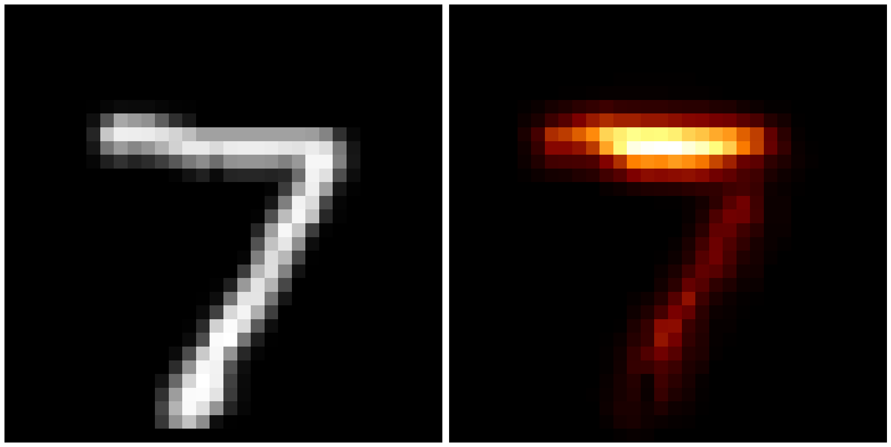
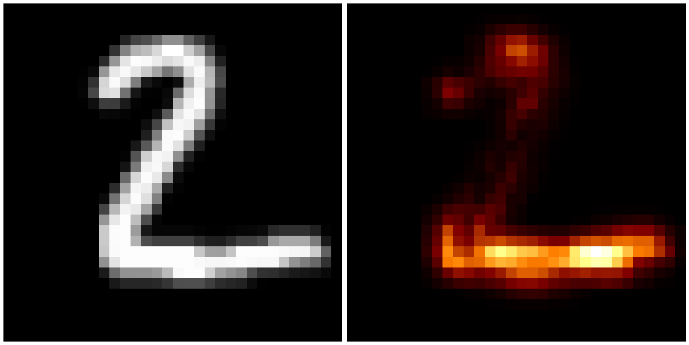
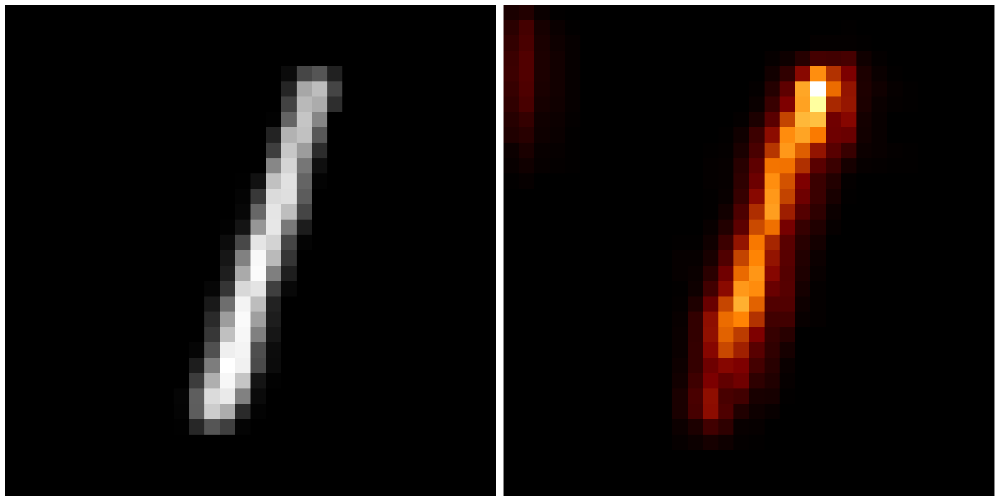
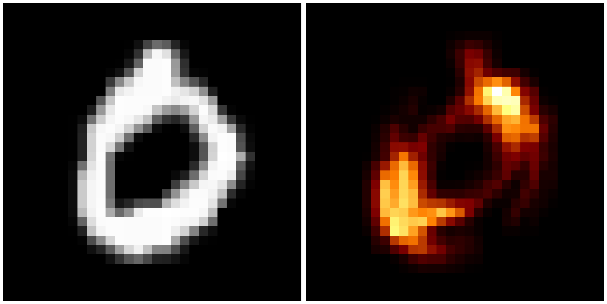
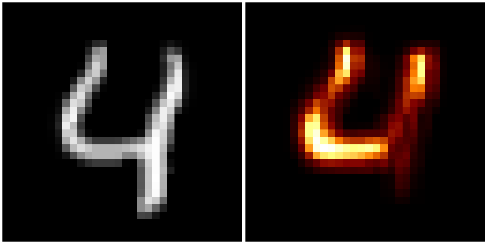

# Source code for Layer-wise Relevance Propagation in PyTorch with Neural Networks from scratch

## Project structure

- core: core source, maybe implemented in C/C++
- data_augmentations: Data augmentations methods
- data_transformations: Data transformation methods
- datasets: datasets for training, and testing model
- docs: contain documents, reports, excel, etc.
- loggers: contain all logging methods, log results for analyzing.
- metrics: contain some metrics implemented for classification, regression.
- models: your model definited here.
- optimizers: optimizers implementation for your training model.
- parameter_tuning: implementation for random search, grid search.
- saved_models: model binary files.
- scripts: some script?
- test: test for fun.
- testers: testers functionality.
- trainers: trainers functionality.
- utils: helper functionality.

## How to custom and train your own neural networks from scratch

### Importing something stuff

```py
from data_transformations import mnist_transform
import torchvision.transforms as transforms

from data_loaders import mnist_dataloader

from loss_funcs import CrossEntropyLoss

from models import VGG11

from trainers import Trainer, MPTrainer
from testers import Tester

import numpy as np
from loggers import set_logger
```

### Transformation and data loaders

```py
def tile_image(image):
    '''duplicate along channel axis'''
    return image.repeat(3,1,1)

transform=[
        transforms.Resize(32),
        transforms.ToTensor(),
        transforms.Normalize((0.1307,), (0.3081,)),
        transforms.Lambda(lambda x: tile_image(x))
        ]
```

```py
train_dataset, test_dataset = mnist_dataloader.get_dataset(
    './datasets', transform=mnist_transform(lst_trans_operations=transform))

print('Train data set:', len(train_dataset))
print('Test data set:', len(test_dataset))
```

### Train test splitting

```py
train_dataloader, valid_dataloader, test_dataloader = mnist_dataloader.loader(
    train_dataset, test_dataset)

train_features, train_labels = next(iter(train_dataloader))
print(f"Feature batch shape: {train_features.size()}")
print(f"Labels batch shape: {train_labels.size()}")

test_features, test_labels = next(iter(test_dataloader))
print(f"Feature batch shape: {test_features.size()}")
print(f"Labels batch shape: {test_labels.size()}")
```

### Define model

Here we use cross-entropy loss function

```py
loss_func = CrossEntropyLoss()
```

Define model

```py
model = VGG11(n_classes=10).cuda()
print(model)
print("Total number of parameters =", np.sum(
    [np.prod(parameter.shape) for parameter in model.parameters()]))

```

### Training stage

For mixed-precision training

```py
trainer = MPTrainer(model, train_dataloader=train_dataloader, valid_dataloader=valid_dataloader,
                    train_epochs=25, valid_epochs=2, learning_rate=0.001, loss_func=loss_func, optimization_method='adam')
model, losses, accuracies = trainer.run()
trainer.save_model('saved_models/vgg11_mnist.model')
```

For normal way

```py
trainer = Trainer(model, train_dataloader=train_dataloader, valid_dataloader=valid_dataloader,
                    train_epochs=25, valid_epochs=2, learning_rate=0.001, loss_func=loss_func, optimization_method='adam')
model, losses, accuracies = trainer.run()
trainer.save_model('saved_models/vgg11_mnist.model')
```

### Testing stage

```py
model_loaded = trainer.load_model('saved_models/vgg11_mnist.model')

tester = Tester(model=model_loaded,
                test_dataloader=test_dataloader, use_gpu=True)

tester.run()
```

## Layer-wise Relevance Propagation

Import something stuff

```py
import torch
import time

from models import LRPModel

device = torch.device("cuda" if torch.cuda.is_available() else "cpu")
```

Helper function for visualization

```py
def plot_relevance_scores(
    x: torch.tensor, r: torch.tensor, name: str,) -> None:
    """Plots results from layer-wise relevance propagation next to original image.
    Method currently accepts only a batch size of one.
    Args:
        x: Original image.
        r: Relevance scores for original image.
        name: Image name.
    """
    max_fig_size = 20

    _, _, img_height, img_width = x.shape
    max_dim = max(img_height, img_width)
    fig_height, fig_width = (
        max_fig_size * img_height / max_dim,
        max_fig_size * img_width / max_dim,
    )

    fig, axes = plt.subplots(nrows=1, ncols=2, figsize=(fig_width, fig_height))

    x = x[0].squeeze().permute(1, 2, 0).detach().cpu()
    x_min = x.min()
    x_max = x.max()
    x = (x - x_min) / (x_max - x_min)
    axes[0].imshow(x)
    axes[0].set_axis_off()

    r_min = r.min()
    r_max = r.max()
    r = (r - r_min) / (r_max - r_min)
    axes[1].imshow(r, cmap="afmhot")
    axes[1].set_axis_off()

    fig.tight_layout()
    plt.show()
```

Run model

```py
lrp_model = LRPModel(model=model, top_k=0.02)

for i, (x, y) in enumerate(test_dataloader):
    if i == 5:
        break
    x = x.to(device)
    # y = y.to(device)  # here not used as method is unsupervised.
    t0 = time.time()
    r = lrp_model.forward(x)
    print("{time:.2f} FPS".format(time=(1.0 / (time.time() - t0))))
    plot_relevance_scores(x=x, r=r, name=str(i))
```









